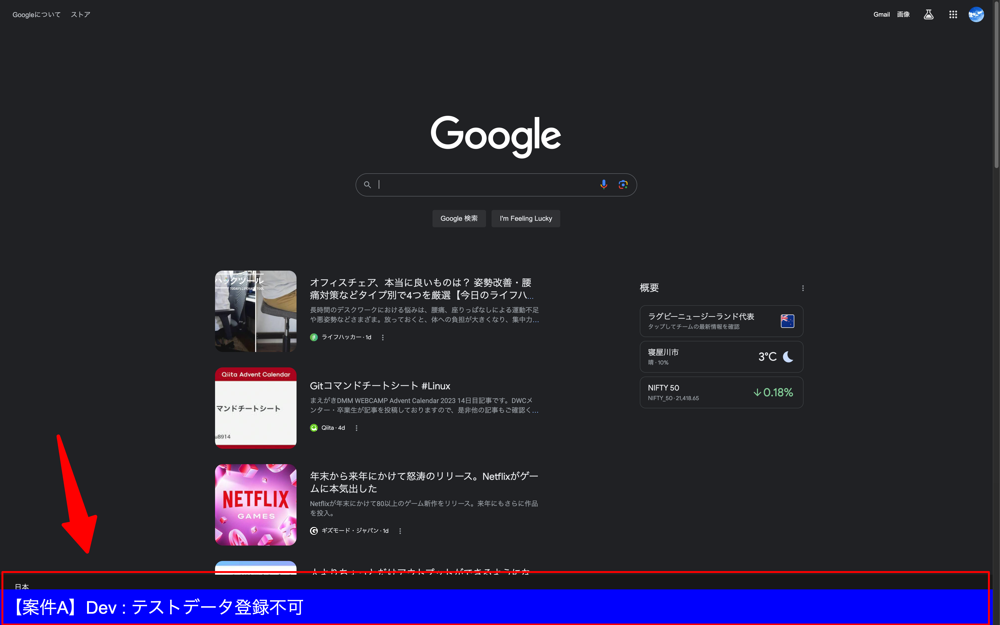
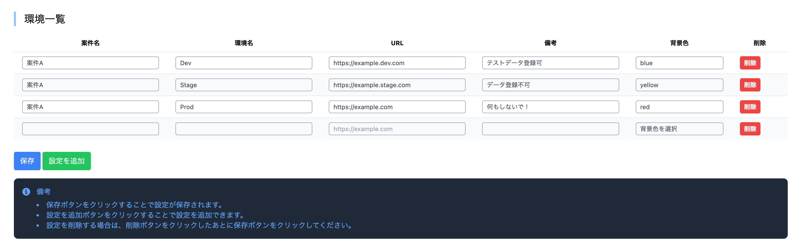
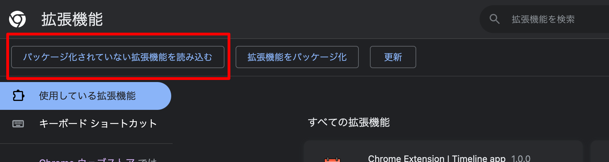

# 環境識別サポート

## 概要

環境識別をサポートします。

### フロントイメージ



ページ下部へ管理画面で登録した情報を表示します。
該当の内容が標示されるのは、管理画面で登録したURLが含まれるページのみです。

### 管理画面イメージ



管理画面で環境識別の情報を登録します。

| 項目名  | 説明                    |
| :------ | :---------------------- |
| 案件名  | 案件名を入力します。    |
| 環境名  | 環境名を入力します。    |
| 環境URL | 環境のURLを入力します。 |
| 備考    | 備考を入力します。      |
| 背景色  | 環境の色を選択します。  |

## 導入手順

### 1. Git Clone

```bash
git clone {xxxx}
```

### 2. パッケージインストール

```bash
npm install
```

### 3. ビルド

```bash
npm run build:all
```

### 4. Chrome拡張機能の設定

1. chrome://extensions/ を開く
2. 「パッケージ化されていない拡張機能を読み込む」をクリック
3. 3:でビルドしたdistディレクトリを選択

